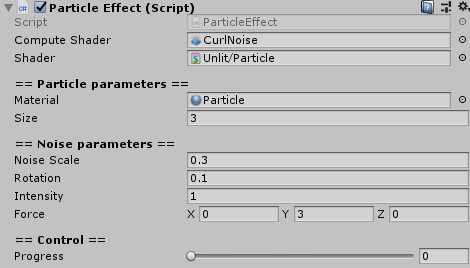

# Simple Noise effect for Unity

This project is simple noise effect for Unity. This project use a compute shader and use point mesh topology to render. So this project will work on OpenGL platforms well. Of cause DirectX platform is supported but the platform has no point rendering.

## How to use

Put a prefab that named "ParticleEffect" into your scene. Then, you can set some parameters for displaying the particle.
You can set it on the inspector like below.

## Parametes

### Noise Scale

Noise scale means PerlinNoise scale. If you change the value, noise will change looking.

### Rotation

Rotation means that rotate each vertex before applying curl noise. So if you change this parameter, then the vertices are moved more aggressive.

### Intensity

Intensity means that how far applying to the value to each vertex. If you change the value, then all vertices are moved more far from origin.